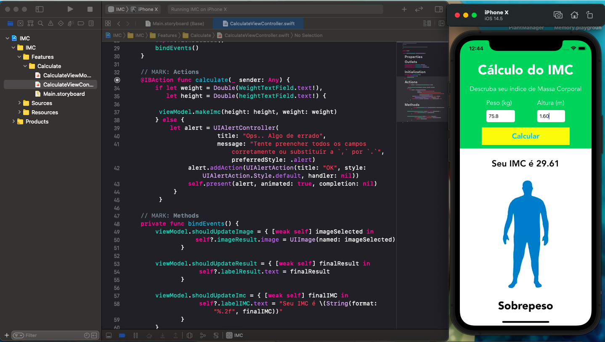

# IMC Calculate

## 📋 Descrição

Nesse repositório está o projeto que desenvolvi como proposta de desafio interno da empresa em que sou colaborador, com proposito de revisar conceitos como autolayout e closures. 

IMC calculate é um app que pega dados de altura e peso e retorna o seu indice de massa corporal, e um resultado mediante a ele.

=)

## 📲 ScreenShots

## 🖥️ Tecnologias

- Swift
- Storyboard

## 🎨 Projeto
*✓ Finalizado (sujeito a melhorias)*

